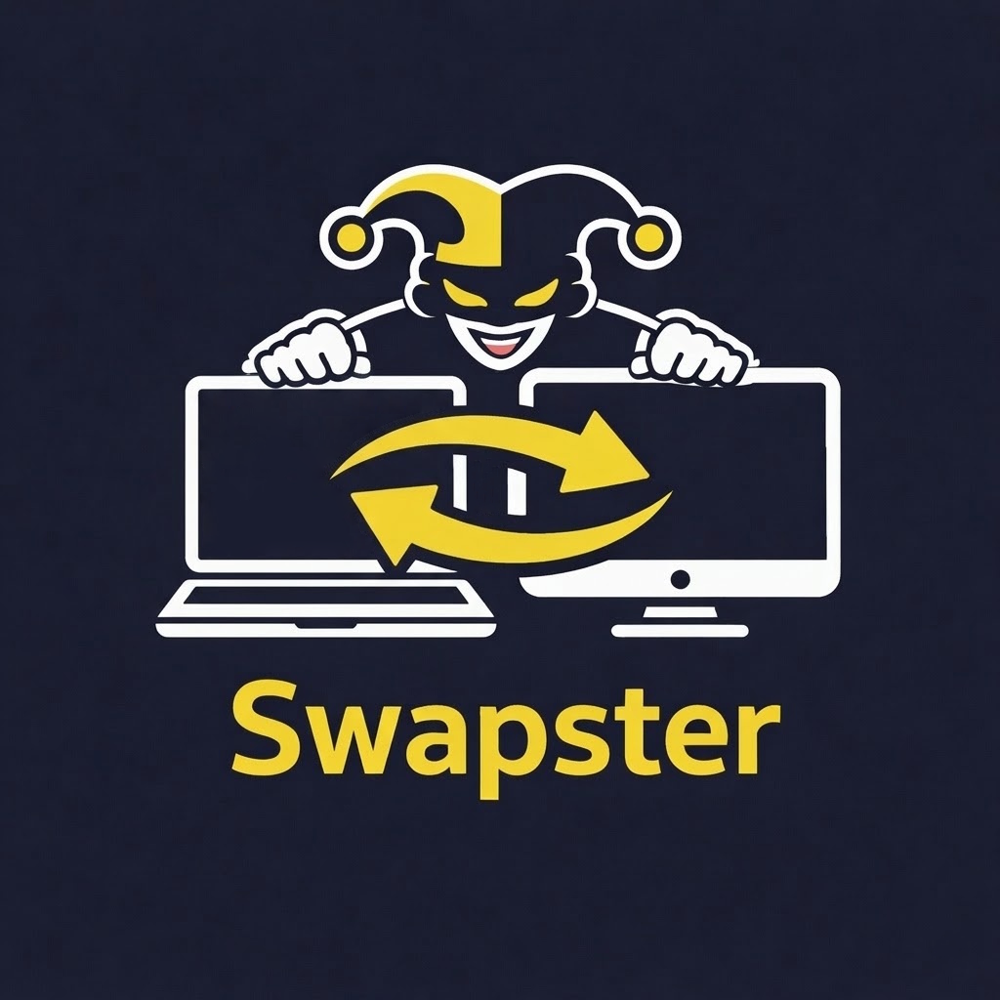

Swapster provides remote monitor-window swapping between Windows x64 machines on the same LAN through an encrypted channel.

## Project Layout

- [src](src): C++ source files
- [include](include): C++ headers
- [scripts/install_swapster.cmd](scripts/install_swapster.cmd): installer launcher (double-click friendly)
- [scripts/install_swapster.ps1](scripts/install_swapster.ps1): elevated installer logic
- [swapster_version.rc](swapster_version.rc): Windows version resource for server binary
- [Makefile](Makefile): MinGW build
- `SwapsterDist`: generated distribution output

## Build

Requirements:
- Windows
- MinGW-w64 (`x86_64-w64-mingw32-g++`)
- `windres` at `C:\msys64\mingw64\bin\windres.exe`

Build (from repo root):

```powershell
mingw32-make clean
mingw32-make
```

For debug builds with logging enabled:

```powershell
mingw32-make clean
mingw32-make L=1
```

When built with `L=1`, the server writes logs to `C:\ProgramData\Swapster\swapster_log.txt`, including:
- Server startup with port number
- Controller connections/disconnections with IP addresses
- Window swap operations
- Critical errors

Output:
- `SwapsterDist\swapster.exe`
- `SwapsterDist\controller.exe`
- `SwapsterDist\install_swapster.cmd`
- `SwapsterDist\install_swapster.ps1`

## Install Server on Target Machine

1. Move the `SwapsterDist` folder to the target machine.
2. Run `SwapsterDist\install_swapster.cmd` (it self-elevates when needed).

Installer actions:
- Copies server to `%ProgramData%\Swapster\swapster.exe`
- Creates scheduled task `Swapster_Server_OnStartup` (interactive user, runs at logon)
- Adds Windows Firewall allow rules:
  - **TCP port 2003**: For encrypted client communication
  - **UDP port 2003**: For broadcast discovery
- Starts server immediately on port `2003`

## Controller Usage

From `SwapsterDist`:

Auto-discovery:

```cmd
controller.exe
```

The controller searches for Swapster servers on the local network by:
1. Broadcasting `SWAPSTER_DISCOVER` on UDP port 2003 to all network adapters
2. Listening for `SWAPSTER_READY`/`SWAPSTER_BUSY` responses
3. Automatically connecting to the first server that responds

Direct connect:

```cmd
controller.exe <server_ip> 2003
```

Direct mode sends a UDP discovery probe to the target IP and waits up to 5 seconds for `SWAPSTER_READY`.

Commands after connection:
- `SWAP` -> swaps windows on the target machine
- `TERM` -> stops the server process (no uninstall)
- `WIPE` -> triggers full server cleanup/uninstall flow
- `EXIT` -> disconnects the controller

## TERM / Cleanup Behavior

When `TERM` is sent:
- Server shuts down cleanly
- Existing install files, task, and firewall rules remain intact

When `WIPE` is sent:
- Server launches cleanup mode
- Deletes scheduled task (`Swapster_Server_OnStartup`)
- Removes Windows Firewall rules (TCP and UDP)
- Stops other running `swapster.exe` instances
- Deletes the currently running server executable path
- Removes `%ProgramData%\Swapster`

## Troubleshooting

### Server Not Found During Discovery

If auto-discovery fails to find the server:
- **Both machines must be on the same subnet**: UDP broadcast only works within a local network segment
- **Multiple network adapters**: The controller tries all adapters, prioritizing those with gateways (real adapters over virtual ones like VMware/VirtualBox)
- Check that Windows Firewall allows **UDP port 2003** on the server (the installer creates this rule automatically)
- Verify that the firewall rules exist on the server:
  ```cmd
  netsh advfirewall firewall show rule name="Swapster Discovery"
  netsh advfirewall firewall show rule name="Swapster Server"
  ```
- Try direct connection if on different subnets: `controller.exe <server_ip> 2003`
- Verify the server is running: check Task Manager for `swapster.exe`
- If built with `L=1`, check logs at `C:\ProgramData\Swapster\swapster_log.txt` on the server

If direct connect fails (`controller.exe <server_ip> 2003`):
- Verify UDP port 2003 is reachable from the controller machine (direct mode still requires `SWAPSTER_READY`)
- Verify TCP port 2003 is reachable from the controller machine
- Ensure the target server is not currently in `SWAPSTER_BUSY` state

## Notes

- **Multi-adapter Support**: The controller automatically tries all network adapters, prioritizing real adapters (with gateways) over virtual ones
- **Encryption**: All commands use AES-256-CTR encryption with HMAC-SHA256 authentication after initial handshake
- The installer expects `swapster.exe` to be in the same folder as `install_swapster.cmd`/`install_swapster.ps1` when run
- The installer can be run from a USB drive
- If multiple Swapster servers are on the same LAN, auto-discovery connects to the first one that responds
